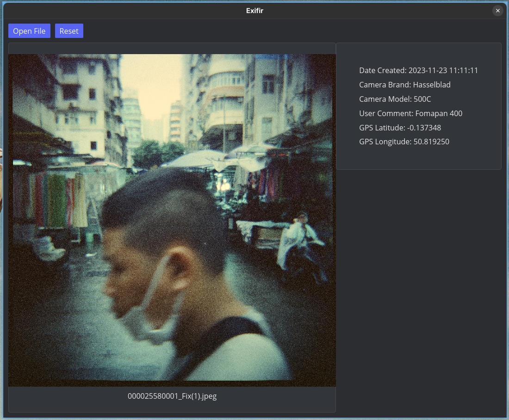

<div align="center">


# Exifir

A small desktop app for viewing and editing image EXIF metadata, written in Rust using <a href="https://github.com/iced-rs/iced">iced</a>.



</div>


## ⬇️ Download
One day I will ship some prebuilt binaries, for now you need to build from source.
## 🔨 Build from source
First, pull the repo however you like.\
Then build with:
```
cd exifir; cargo build --release
```
And run the binary with:
```
./target/release/exifir
```

## 📢 Feedback

Feel free to create issues on GitHub for any bugs, feature requests, or general feedback.